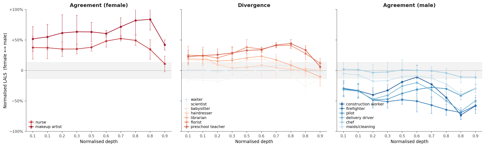

# LALS: Latent Association Leaning Score

> **Vision-Language Models Suppress Female Representations Under Ambiguous Input**
> 
> Arnau Marin-Llobet, Simon Henniger, Mahzarin R. Banaji. *EMNLP 2026.*
> [arXiv:2605.31556](https://arxiv.org/abs/2605.31556)

LALS measures, for every visual token of a vision-language model and at every layer, whether
the token leans towards female (positive) or male (negative) concepts. It needs no training.



## Contents

```
notebooks/demo.ipynb    kitchen-scene heatmaps and LALS across layers
utils/functions.py      how LALS is defined
utils/models.py         the vision-language models (Qwen2-VL, Qwen2.5-VL, LLaVA-NeXT, InternVL2.5)
utils/plots.py          the plots
utils/build_text_db.py  builds the reference text database of a model
data/examples/          example images: the kitchen scenes of Figure 3 and 8 occupation images
data/processed/         the paper's LALS values (4 models, 15 occupations, 25 images, 7 layers)
```

## Quick start

```bash
pip install -r requirements.txt

# 1. Reference text database (once, about 30 minutes on a GPU), from the COCO 2017 captions
wget http://images.cocodataset.org/annotations/annotations_trainval2017.zip
unzip annotations_trainval2017.zip annotations/captions_train2017.json
python -m utils.build_text_db --model qwen25vl --coco-captions annotations/captions_train2017.json

# 2. Demo (GPU, a few minutes)
jupyter notebook notebooks/demo.ipynb
```

Exact numbers can fluctuate slightly depending on the GPU, library versions and model revision
you use (less than 1% of the LALS range).

## Using LALS on your own images

```python
from utils.functions import LALSScorer, TextDB, image_summary
from utils.models import load_image, load_vlm

vlm = load_vlm("qwen25vl")
scorer = LALSScorer(TextDB.load("embeddb/qwen25vl", layer=16), k=20)
hidden = vlm.visual_token_states(load_image("photo.png"), layers=[16])[16]
print(image_summary(scorer.token_scores(hidden)))   # mean LALS of the image (+ female / - male)
```

## Citation

```bibtex
@article{marin2026vision,
  title={Vision-Language Models Suppress Female Representations Under Ambiguous Input},
  author={Marin-Llobet, Arnau and Henniger, Simon and Banaji, Mahzarin R},
  journal={arXiv preprint arXiv:2605.31556},
  year={2026}
}
```

## License

MIT (`LICENSE`).
